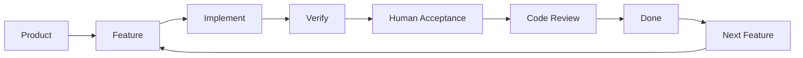

# Yaya Loop

**English** | [简体中文](./README.zh-CN.md)

> **AI can write code. The hard part is keeping a project under control after hundreds of iterations.**

Yaya Loop is a development workflow for long-running AI-assisted software projects.

It breaks Product requirements into small, bounded, independently verifiable Features so an AI works toward one explicit objective at a time. Product documents, Coding Rules, automated checks, human acceptance, and independent code review turn those individual sessions into a development loop that can keep running as the project grows.

**Product → Feature → Implement → Verify → Review → Ship → Next Feature ↺**

Current release: `v0.1.0`

The core methodology and the Godot and GDScript rules come from real project experience. Rules for other languages and stacks are still being expanded.

---

## What problem does Yaya Loop solve?

### 1. AI can write code, but a project can still drift out of control

Asking an AI to add one feature is rarely the difficult part anymore.

The real question is:

> **After dozens or hundreds of Features, is the project still maintainable?**

As a codebase grows, AI-assisted development tends to accumulate familiar problems:

- Current requirements drift away from earlier decisions.
- A small request quietly changes unrelated behavior.
- Features grow until every change touches too much code.
- The AI forgets design principles established early in the project.
- Fixing one bug introduces another.
- Adding new behavior or changing old behavior becomes progressively harder.
- The AI runs tests and declares success without anyone verifying the real behavior.
- The application still runs, but its structure and maintainability slowly deteriorate.

Yaya Loop is designed to address that long-term failure mode:

> **The goal is not merely to let AI write code, but to let it keep writing code without the project gradually becoming unmanageable.**

It does not try to make the AI produce more code in one pass.

It deliberately does the opposite:

**Each iteration should solve one problem that is small enough to understand, bounded enough to control, and concrete enough to verify.**

---

### 2. Use natural language to direct a stack you do not yet know well

AI also enables a different way to approach unfamiliar technology.

You do not necessarily need to master every API, syntax rule, and engineering convention before you can begin building with a stack.

You might know Python but want to build a game with Godot and GDScript. Or you might work mainly on backend systems but need to create a frontend, desktop utility, or small game.

With Yaya Loop, your ongoing responsibility is to express:

- what the Product should do;
- what the current Feature must accomplish;
- which observable behavior counts as complete;
- which design principles must remain true; and
- whether the application actually behaves as expected.

The AI handles the implementation details.

The conversation can gradually move away from:

`How do I call this API? Which class should this inherit from? What is the syntax here?`

and toward:

`I want to add this capability.`

`This behavior does not match the requirement. Change it this way.`

`Do the next Feature.`

This does not mean that someone with no software knowledge can complete any complex project without limits.

The aim is more practical:

> **Reduce the technology stack's grip on the developer, so natural language, durable rules, and human verification can provide long-term control even when the low-level implementation is unfamiliar.**

---

## How does it work?

The central idea is simple:

> **Do not ask an AI to start by building one “large project.”**

First, put the project's long-term development state inside the repository. Then constrain each AI coding session to a sufficiently small scope.

Yaya Loop maintains three layers of durable knowledge:

| Layer | Question it answers | Purpose |
| --- | --- | --- |
| **Product** | What should the Product do? | Preserves long-term requirements as the source of truth |
| **Feature** | What exactly are we doing in this iteration? | Turns Product requirements into bounded, independently verifiable work |
| **Coding Rules** | How may it be implemented? | Preserves architecture, quality, and stack-specific constraints |

Each Feature then moves through a fixed development loop:



The filenames themselves are not the important part. The important change is this:

> **Requirements, tasks, code, and acceptance no longer depend only on the current chat window.**

The repository carries its own long-term state. A new AI session needs to load only the context required for the current Feature.

---

## Why does this reduce AI drift?

Yaya Loop turns responsibilities that would otherwise depend on the AI's discretion into explicit process constraints.

| Common failure | Yaya Loop response |
| --- | --- |
| Requirements change during conversation | Product preserves the durable requirement source |
| The AI expands the requested change | Feature scope and acceptance criteria set the boundary |
| Earlier design decisions are forgotten | Coding Rules preserve long-term engineering constraints |
| A new session does not know what happened last time | Feature state, Progress, notes, and handoff records preserve context |
| Passing tests is treated as completion | **Explicit human acceptance is required** |
| The feature works but the codebase gets worse | A fresh-context Code Smell Scan runs before completion |
| The AI skips the workflow and commits anyway | Hooks and Git gates provide additional admission checks |

Yaya Loop is therefore not mainly about writing a more elaborate Prompt.

It is about:

> **Reducing the AI's room for error, one explicit boundary at a time.**

---

## Can the AI decide that it is finished?

No.

This is one of Yaya Loop's core principles.

Compilation proves that the code compiles. Passing tests proves that the behavior covered by those tests passes.

Neither proves that:

> **The Feature's real behavior matches the user's expectation.**

Machines should verify what machines are good at, including:

- compilation;
- type checking;
- linting;
- unit tests; and
- project-specific static checks.

Behavior that requires observation or Product judgment still needs human acceptance.

**Without explicit confirmation from the user, an AI must not mark a Feature `done`.**

After human acceptance, the current changes are reviewed for structural problems. The Code Smell Scan should use a fresh-context agent when available: it reloads the Coding Rules and independently inspects the Feature's actual diff.

Findings are classified as:

- `must_fix`: must be resolved before the current Feature can complete;
- `suggest`: worth considering later, but does not block the Feature; or
- `acceptable`: a reasonable tradeoff that is not worth extra complexity merely to make the code look cleaner.

The Feature is complete only after every `must_fix` finding is cleared.

---

## How is this different from using Claude Code or Codex directly?

Claude Code, Codex, Aider, Cursor, and other AI Coding Agents are already very capable at:

> **Writing code.**

Yaya Loop focuses on a different problem:

> **How can that code be written iteration after iteration without the project gradually losing control?**

| Direct Vibe Coding | Yaya Loop |
| --- | --- |
| A Prompt goes directly into code | Requirements enter Product and Feature state first |
| The AI decides the change boundary | The Feature explicitly limits the current scope |
| The chat carries most of the context | Repository documents preserve long-term state |
| Passing tests may be treated as complete | Human acceptance is mandatory |
| The next Prompt starts as soon as it runs | Code review and smell scanning still happen before Done |
| Prompt → Prompt → Prompt | Feature → Verify → Done → Next |

Yaya Loop does not replace a Coding Agent.

It is a layer around that agent:

> **A control loop for long-running development.**

---

## Why split requirements into Features?

Because:

> **“Build a large project” is too broad for an AI, while “complete this bounded capability” is often quite manageable.**

Product describes the complete application. Features turn it into a sequence of independently executable problems.

For example:

`Build a complete game`

is clearly too broad.

Even:

`Implement the entire shop system`

may still be too broad. It can be decomposed into:

- shop initialization;
- item-pool generation;
- inventory refresh;
- purchasing an item;
- currency validation;
- refresh pricing;
- UI-state updates; and
- invalid-operation handling.

A large project no longer requires the AI to understand and complete the entire system at once.

Instead:

> **Solve one problem carefully, then leave enough durable context for the next iteration.**

---

## Can this approach support a substantial project?

Yaya Loop was not designed in isolation and then attached to a convenient demonstration.

It grew out of using AI over the long term to build a real project: a game reproducing the core gameplay loop of *Backpack Battles*.

During development, the project was gradually decomposed into:

**600+ Features**

and produced:

**2,000+ Git commits**

Those Features covered far more than a disposable demo:

- combat systems;
- items;
- the shop;
- UI and interaction;
- balance and content;
- bug fixes;
- architecture changes; and
- refactoring.

The process can be summarized as:

**Product requirements → 600+ Features → implementation and acceptance one by one → 2,000+ commits → continuous refactoring and evolution**

This does not prove that Yaya Loop guarantees a commercially successful game.

It demonstrates something more specific:

> **A real and continuously growing software project can be divided into hundreds of small problems that an AI completes one at a time.**

The challenge changes from asking an AI to remember and understand the entire project indefinitely to:

> **Let the repository preserve long-term state, and give each AI session only the context needed for the current Feature.**

Yaya Loop was extracted and refined from that process.

> **Case study:** The example project is planned for release after commercially sensitive information and core operational data have been removed. It will illustrate real Features, commit history, and long-running iteration.

---

## What does day-to-day development look like?

Most work falls into three modes:

| Mode | What you do | Example |
| --- | --- | --- |
| **Product programming** | Describe a new requirement or Product change in natural language | `I want to add XXX.` |
| **Feature development** | Ask the AI to execute one prepared Feature | `Do the next Feature.` |
| **Controlled refactoring** | Select one recorded code smell to address | `Pick one code smell to refactor.` |

### Product programming

When you have a new idea, you do not need to edit a dozen task files manually.

Describe the Product change:

`I want to add XXX.`

or:

`The current XXX design is wrong. Change it to XXX.`

Yaya Loop updates Product first, then incrementally synchronizes the affected Features.

**Natural-language requirement → Product → Feature List**

not:

**Natural-language requirement → AI edits code immediately**

### Feature development

Once requirements are ready:

`Do the next Feature.`

The AI loads the required context, confirms scope, implements the Feature, runs automated verification, and waits for human acceptance.

Only after acceptance and the Code Smell Scan does the Feature become Done.

Then the workflow stops. The next Feature begins only when authorized.

### Controlled refactoring

Long-running development inevitably creates technical debt.

Yaya Loop does not require every imperfect line of code to trigger an immediate large refactor. Non-blocking findings may enter the smell backlog.

At an appropriate time, ask:

`Pick one code smell to refactor.`

The long-term loop becomes:

**Product change → Feature → Implement → Accept → Done → Refactor when justified → Continue ↺**

---

# How do I get started?

## 1. Get Yaya Loop

```bash
git clone https://github.com/m358807551/yaya-loop.git ~/code/yaya-loop
```

You may also copy the repository to any location you prefer.

---

## 2. Enter the project you actually want to build

Both new and existing projects are supported.

```bash
cd ~/code/<your-project>
```

Open the project with an AI Coding Agent that can read and modify files and run commands, such as:

- Claude Code
- Codex
- Aider
- Cursor
- another compatible agent

---

## 3. Ask the AI to initialize Yaya Loop

Give it this instruction:

```text
Follow the steps in ~/code/yaya-loop/BOOTSTRAP.md
to initialize Yaya Loop in the current project.
```

Then answer the questions the AI asks during initialization.

---

## 4. Start developing

After initialization, most daily requests are as simple as:

- `I want to add XXX.`
- `Change XXX behavior to YYY.`
- `Do the next Feature.`
- `Pick one code smell to refactor.`

Yaya Loop maintains Product and Feature state, loads context, and enforces the execution process around those requests.

---

## Does it work for both new and existing projects?

Yes.

### Greenfield

For a new project, Yaya Loop starts from the Product idea:

**Natural language → Product → Coding Rules → Feature List → Implementation**

Once initialized, Features can be executed one by one.

### Legacy

For an existing project, Yaya Loop first studies the current code and then reconstructs:

- current Product capabilities;
- representative completed Features;
- likely future work confirmed by the user;
- project-specific Coding Rules; and
- known code smells.

Adopting Yaya Loop does not require rewriting the application.

See [`BOOTSTRAP.md`](./BOOTSTRAP.md) for the complete process and [`examples/legacy-import-walkthrough.md`](./examples/legacy-import-walkthrough.md) for a narrative example.

---

## Who is it for?

Yaya Loop is a good fit when you:

- use an AI Coding Agent to develop a real project over time;
- expect the project to keep gaining Features rather than ending after a few scripts;
- have noticed that pure Vibe Coding becomes harder to control as the codebase grows;
- want the AI to handle much of the implementation while humans retain Product judgment;
- want to work with an unfamiliar language, framework, or game engine;
- are an independent developer or part of a small team; or
- prefer to drive development mainly through natural language.

If the whole project is a few dozen lines that one or two Prompts can complete, this workflow may be unnecessarily heavy.

---

## What does it not solve?

### It is not a project-management tool

There are no Gantt charts, burn-down charts, or team boards.

`feature-list.json` is durable working state for AI-assisted development, not a project manager's reporting dashboard.

### It is not CI/CD

Compilation, type checks, and tests during Feature execution do not replace a production CI pipeline.

### It is not a code-generation model

Claude Code, Codex, Aider, Cursor, or another Coding Agent still writes the code.

### It is not a silver bullet

Yaya Loop cannot rescue a Product with incoherent requirements, badly decomposed Features, or vague acceptance criteria by itself.

It is better understood as an amplifier:

> **It turns well-understood intent into code more consistently.**

---

# For AI agents and readers who want the internal model

If you only want to start using Yaya Loop, the sections above are enough.

The rest of this README explains how Yaya Loop preserves state and constrains execution internally.

---

## Core documents

A target project maintains three kinds of long-term state:

| Document | Meaning |
| --- | --- |
| `docs/product.md` + `docs/product/*.md` | **What:** What should the Product do? |
| `docs/feature-list.json` + `docs/features/F0XX.json` | **Todo:** What exactly should happen now and later? |
| `docs/coding_rules.md` | **How:** What implementation constraints apply? |

The Feature index remains lightweight. Detailed Feature state is loaded on demand so a growing project does not force every new session to reread its entire history.

Durable Product, Feature, and Progress prose uses the target project's configured `document_language`. Stable protocol elements—JSON keys, Feature IDs, status values, paths, evidence strings, and commands—remain English or language-neutral.

---

## Feature execution loop

`execute-next-feature` uses fixed Stages 0–8:

**Preflight → Resource and dependency checks → Start → Implement with focused commits → Automated verification → Human acceptance → Fresh-context Code Smell Scan → Done → Handoff**

Important constraints include:

1. Do not expand the current Feature's scope without approval.
2. Stop and resolve requirement ambiguity instead of guessing.
3. An AI must never mark a Feature Done by itself.
4. Human acceptance does not replace the Code Smell Scan.
5. A Feature cannot complete while any `must_fix` finding remains.
6. The completion commit must contain the required admission evidence.
7. Do not work directly on `main` or `master`.
8. Do not automatically perform dangerous Git operations.

See [`methodology/`](./methodology/) for the complete canonical rules.

---

## Three groups of AI capabilities

Yaya Loop currently provides three main groups of workflows.

### Product

Maintain natural-language requirements as durable Product specifications. This includes Product initialization, requirement changes, standardization, UI sketches, and audio entries.

### Generate

Decompose Product into Features, or incrementally synchronize the Feature List after Product changes.

### Execute

Execute one Feature, or select one recorded code smell for controlled refactoring.

Claude Code can consume these workflows as Skills and Hooks. Other AI Coding Agents can use the portable Prompts and Git Hook integration.

---

## Repository map

| Path | Purpose |
| --- | --- |
| [`README.md`](./README.md) | English project introduction and starting point |
| [`README.zh-CN.md`](./README.zh-CN.md) | Complete Simplified Chinese project introduction |
| [`BOOTSTRAP.md`](./BOOTSTRAP.md) | Entry point for an AI initializing Yaya Loop |
| [`methodology/`](./methodology/) | Stack-independent methodology, schemas, templates, and execution rules |
| [`coding-rules-library/`](./coding-rules-library/) | Coding Rules for languages and engines |
| [`claude-code/`](./claude-code/) | Claude Code Skills, Hooks, and configuration |
| [`ai-agnostic-prompts/`](./ai-agnostic-prompts/) | Portable Prompts for other AI Coding Agents |
| [`git-hooks/`](./git-hooks/) | Git-level workflow admission checks |
| [`examples/`](./examples/) | Greenfield reference project and Legacy adoption walkthrough |
| [`tests/`](./tests/) | Tests for Yaya Loop itself |
| [`upgrade-notes.md`](./upgrade-notes.md) | Kit upgrade and migration notes |

If you are an AI explicitly authorized to initialize Yaya Loop in a project:

> **Read [`BOOTSTRAP.md`](./BOOTSTRAP.md) and follow its steps.**

---

## Feedback and extensions

Yaya Loop is still at an early stage.

If you use it with a new:

- programming language;
- game engine;
- web framework;
- desktop framework; or
- mobile stack;

and develop reusable practices:

1. validate them first in a real project's `docs/coding_rules.md`;
2. contribute them to `methodology/` or `coding-rules-library/` only after they prove generally useful; and
3. update `kit-version.txt` according to semantic versioning when changing the Kit itself.

Read [`CONTRIBUTING.md`](./CONTRIBUTING.md) before contributing.

Report security issues privately according to [`SECURITY.md`](./SECURITY.md).

---

## License

[MIT License](./LICENSE)

You may use, copy, modify, and distribute this project commercially. Redistributions of the project or a substantial portion of it must retain the copyright and license notice.
