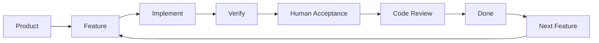

# Yaya Loop

[English](./README.md) | **简体中文**

> **AI 会写代码。难的是连续写几百次之后，项目仍然可控。**

Yaya Loop 是一套面向长期 AI 编程的开发工作流。

它把产品需求拆成大量边界清晰、可以独立验收的 Feature，让 AI 一次只推进一个明确目标；同时通过产品文档、编码规则、自动检查、人工验收和代码审查，让一次次 AI 编程形成可以长期运行的开发闭环。

**Product → Feature → Implement → Verify → Review → Ship → Next Feature ↺**

当前版本：`v0.1.0`

核心方法论、Godot 与 GDScript 规则来自真实项目实践；其他语言和技术栈的规则仍在持续补充。

---

## Q：这个项目解决了什么问题？

### 1. AI 很会写代码，但项目很容易越写越失控

今天让 AI 加一个功能，通常已经不难。

真正困难的是：

> **连续开发几十个、几百个 Feature 之后，项目还能不能继续维护？**

随着项目越来越大，AI 编程很容易出现这些问题：

* 当前需求和历史需求逐渐脱节；
* 一个小修改顺手改了一堆没有要求的东西；
* Feature 越做越大，一次改动牵连越来越多代码；
* AI 忘记项目早期已经确定的设计原则；
* 修一个 Bug，又引入另一个 Bug；
* 新增功能和修改旧功能越来越困难；
* AI 跑完测试以后就宣布“完成”，但实际行为并没有真正验收；
* 代码还能运行，但结构和可维护性在一点点恶化。

Yaya Loop 首先试图解决的就是这个问题：

> **让 AI 不只是能把代码写出来，还能连续写下去，而项目不会逐渐失控。**

它并不追求让 AI 一次写更多代码。

恰恰相反：

**它尽量让 AI 每次只解决一个足够小、足够明确、可以验收的问题。**

---

### 2. 用自然语言掌控自己并不熟悉的技术栈

AI 还带来了另一种新的开发方式：

你不一定要先熟练掌握一个技术栈的所有语法、API 和工程细节，才能开始使用它开发项目。

比如：

你熟悉 Python，但突然想用 Godot + GDScript 做一个游戏；

或者你主要做后端，却需要开发一个前端、桌面工具或者小游戏。

在 Yaya Loop 中，你主要负责持续表达：

* 产品到底要什么；
* 当前 Feature 要实现什么；
* 什么行为算完成；
* 哪些设计原则不能违反；
* 实际运行结果是否符合预期。

具体的技术实现交给 AI。

因此，人和 AI 之间的主要交流可以逐渐从：

`这个 API 怎么调？这里应该继承哪个类？这个语法怎么写？`

变成：

`我想增加这个功能。`

`这个行为不符合需求，应该改成这样。`

`做下一个 Feature。`

这并不意味着完全不懂软件开发，也可以无条件完成任何复杂项目。

它更希望做到的是：

> **降低技术栈本身对开发者的束缚，让你即使不熟悉底层实现细节，仍然可以通过自然语言、规则和验收长期掌控项目。**

---

## Q：它是怎么做到的？

核心思想并不复杂：

> **不要直接让 AI 开始写一个“大项目”。**

先把长期开发状态放进项目本身，再把每一次 AI 编程限制在一个足够小的范围内。

Yaya Loop 主要维护三层信息：

| 层 | 回答的问题 | 作用 |
| --- | --- | --- |
| **Product** | 产品到底要什么？ | 保存长期产品需求，作为需求的真实来源 |
| **Feature** | 这一轮具体做什么？ | 把 Product 拆成边界清晰、可以验收的小任务 |
| **Coding Rules** | 允许怎么实现？ | 保存架构、代码质量和技术栈相关的长期约束 |

然后让一个 Feature 经过固定的开发闭环：



这里真正重要的不是这几个文件叫什么，而是：

> **需求、任务、代码和验收之间不再只依赖当前聊天窗口。**

项目自己保存长期状态。

AI 每次只需要读取完成当前 Feature 真正需要的那部分上下文。

---

## Q：为什么这样可以减少 AI 失控？

因为 Yaya Loop 尽量把一些原本依赖“AI 自觉”的事情，变成明确的流程约束。

| 常见问题 | Yaya Loop 的处理方式 |
| --- | --- |
| 需求聊着聊着就变了 | Product 保存长期产品需求 |
| AI 擅自扩大修改范围 | Feature 明确 Scope 和 Acceptance Criteria |
| AI 忘记之前的设计原则 | Coding Rules 保存长期工程约束 |
| 新会话不知道上次发生了什么 | Feature 状态、Progress、Notes 和 Handoff 保存上下文 |
| 测试通过就宣布完成 | **必须经过人工验收** |
| 功能能跑，但代码越来越烂 | 完成前进行 Fresh-context Code Smell Scan |
| AI 跳过流程直接提交 | Hook / Git Gate 提供额外准入检查 |

所以 Yaya Loop 的核心并不是：

> 写一个更厉害的 Prompt。

而是：

> **一步一步压缩 AI 在当前任务中的错误自由度。**

---

## Q：AI 不能自己判断“我已经完成了吗”？

不能。

这是 Yaya Loop 很重要的一条原则。

代码可以编译，只代表代码可以编译。

测试通过，只代表已经覆盖到的测试通过。

它们都不能证明：

> **这个 Feature 的真实行为已经符合用户预期。**

因此，机器适合验证的事情交给机器，例如：

* 编译；
* 类型检查；
* lint；
* 单元测试；
* 项目自己的静态检查命令。

但是需要真实观察和产品判断的行为，仍然需要人工验收。

**没有用户明确确认，AI 不能自行把 Feature 标记为 Done。**

人工验收通过之后，还需要检查这一轮代码有没有引入新的结构问题。

Code Smell Scan 会尽量交给 fresh-context 的 Agent：重新读取 Coding Rules，再独立检查当前 Feature 的实际改动。

扫描结果分为：

* `must_fix`：当前 Feature 完成前必须处理；
* `suggest`：值得以后处理，但不应该阻塞当前 Feature；
* `acceptable`：可以接受，不值得为了“代码更漂亮”继续增加复杂度。

只有必须处理的问题归零以后，这个 Feature 才真正完成。

---

## Q：这和直接使用 Claude Code / Codex 有什么区别？

Claude Code、Codex、Aider、Cursor 等 AI Coding Agent 本身已经非常擅长：

> **写代码。**

Yaya Loop 更关心的是：

> **这些代码怎样一轮一轮地写下去，而项目不会逐渐失控。**

简单来说：

| 直接 Vibe Coding | Yaya Loop |
| --- | --- |
| Prompt 直接进入代码 | 需求先进入 Product / Feature |
| AI 自己判断修改范围 | Feature 明确限制当前范围 |
| 当前会话承担大量上下文 | 项目文档保存长期状态 |
| 测试通过就可能宣布完成 | 必须经过人工验收 |
| “能跑”以后继续下一个 Prompt | 完成前还有 Code Review / Smell Scan |
| Prompt → Prompt → Prompt | Feature → Verify → Done → Next |

Yaya Loop 不替代 Coding Agent。

它更像套在 Coding Agent 外面的一层：

> **长期开发控制循环。**

---

## Q：为什么要把需求拆成 Feature？

因为：

> **“开发一个大型项目”对 AI 来说太大了，但“完成一个边界明确的小功能”通常已经很容易。**

Product 负责描述完整产品。

Feature 负责把它变成大量可以独立执行的小问题。

例如：

`做一个完整游戏`

显然太大。

甚至：

`实现完整的商城系统`

可能仍然太大。

它还可以继续拆成：

* 商城初始化；
* 商品池生成；
* 商品刷新；
* 商品购买；
* 金币校验；
* 刷新价格；
* UI 状态更新；
* 异常行为处理；
* ……

于是一个大型项目不再要求 AI：

> 一次理解并完成整个系统。

而变成：

> **每次认真解决一个问题，然后留下足够的信息给下一轮。**

---

## Q：这种方法真的可以用于一个比较大的项目吗？

Yaya Loop 并不是先凭空设计了一套方法论，再寻找一个项目验证它。

它来自真实项目长期使用 AI 编程的实践。

我曾经使用这套思路开发一个复刻《背包乱斗》核心玩法的游戏项目。

在持续开发过程中，这个项目被逐渐拆成了：

**600+ 个 Feature**

并产生了：

**2000+ 个 Git Commit**

这些 Feature 覆盖的不只是一个 Demo，而是一个真实游戏项目持续增长过程中不断出现的：

* 战斗系统；
* 道具系统；
* 商店；
* UI；
* 交互；
* 数值；
* 内容；
* Bug 修复；
* 架构调整；
* 重构。

整个过程可以概括成：

**产品需求 → 600+ Features → 逐个实现和验收 → 2000+ Commits → 持续重构和演化**

这个案例并不是为了证明：

> “Yaya Loop 可以做出一款商业成功的游戏。”

它证明的是另一个问题：

> **一个真实、持续增长的软件项目，可以被拆成几百个足够小的问题，然后让 AI 一个一个完成。**

大型项目因此从：

> “要求 AI 长期记住并理解整个项目”

变成：

> **“让项目自己保存长期状态，每次只让 AI 理解当前 Feature 需要的上下文。”**

Yaya Loop 就是在这个过程中逐渐被抽离、整理成现在这套工作流的。

> **Case Study：** 示例项目计划在移除商业敏感信息和核心运营数据后开放，用于展示真实的 Feature、Commit 历史和长期迭代过程。

---

## Q：用了它以后，我每天到底怎么开发？

日常开发大致只有三种主要操作：

| 模式 | 你主要做什么 | 示例 |
| --- | --- | --- |
| **产品编程** | 用自然语言描述新增需求或产品变化 | `我想增加 XXX 功能` |
| **Feature 开发** | 让 AI 执行一个已经拆好的 Feature | `做下一个 Feature` |
| **受控重构** | 从累积的 Code Smell 中选择一个处理 | `挑一个坏味道重构` |

### 产品编程

当你产生新的想法时，不需要自己手动修改十几个任务。

直接描述产品变化：

`我想增加 XXX 功能。`

或者：

`原来的 XXX 设计不对，我想改成 XXX。`

Yaya Loop 会先把变化同步到 Product，再增量更新对应 Feature。

**自然语言需求 → Product → Feature List**

而不是：

**自然语言需求 → AI 直接改代码**

---

### Feature 开发

需求确定之后：

`做下一个 Feature。`

AI 会读取当前需要的上下文，确认范围，实现功能，执行自动验证，然后等待人工验收。

验收和 Code Smell Scan 通过后，Feature 才进入 Done。

然后停止。

下一次再继续下一个 Feature。

---

### 受控重构

长期开发一定会产生技术债。

Yaya Loop 并不要求：

> 每发现一点代码不够漂亮，就立刻停下 Feature 进行大重构。

一些非阻塞问题可以进入 Smell Backlog。

在合适的时候再说：

`挑一个坏味道重构。`

于是长期开发形成：

**产品变化 → Feature → 实现 → 验收 → Done → 必要时重构 → 继续迭代 ↺**

---

# Q：我要怎么开始使用？

## 1. 获取 Yaya Loop

```bash
git clone https://github.com/m358807551/yaya-loop.git ~/code/yaya-loop
```

也可以直接把仓库复制到你习惯的位置。

---

## 2. 进入你真正要开发的项目

新项目、已有项目都可以。

```bash
cd ~/code/<your-project>
```

然后打开你正在使用的 AI Coding Agent，例如：

* Claude Code
* Codex
* Aider
* Cursor
* 其他能够读取、修改项目文件并执行命令的 Agent

---

## 3. 让 AI 初始化 Yaya Loop

把下面这句话交给它：

```text
请按 ~/code/yaya-loop/BOOTSTRAP.md 的步骤，
把这套方法论在当前项目里初始化好。
```

然后跟着 AI 的问题完成初始化即可。

---

## 4. 开始开发

初始化完成以后，日常主要就是：

* `我想增加 XXX 功能`
* `把 XXX 行为改成 XXX`
* `做下一个 Feature`
* `挑一个坏味道重构`

剩下的 Product / Feature 状态维护、上下文加载和执行流程交给 Yaya Loop。

---

## Q：新项目和已经写了一半的项目都能用吗？

可以。

### Greenfield

对于一个新项目，Yaya Loop 会从你的产品想法开始：

**自然语言 → Product → Coding Rules → Feature List → 开始实现**

初始化完成后就可以逐个推进 Feature。

### Legacy

对于一个已经存在的项目，Yaya Loop 会先尝试理解现有代码，再反向恢复：

* 当前产品能力；
* 已经完成的功能；
* 后续可能需要继续开发的 Feature；
* Coding Rules；
* 已知 Code Smell。

这样不需要为了使用 Yaya Loop 重写整个项目。

完整流程见 [`BOOTSTRAP.md`](./BOOTSTRAP.md)，叙事示例见 [`examples/legacy-import-walkthrough.md`](./examples/legacy-import-walkthrough.md)。

---

## Q：它适合什么人？

Yaya Loop 比较适合：

* 正在使用 AI Coding Agent 长期开发真实项目；
* 项目会持续增加 Feature，而不是只写几个一次性脚本；
* 已经发现纯 Vibe Coding 随着项目增长开始变得难以控制；
* 希望大量实现工作交给 AI，但关键产品判断仍然掌握在人手里；
* 想尝试自己并不熟悉的语言、框架或者游戏引擎；
* 独立开发者或小团队；
* 喜欢主要通过自然语言驱动开发的人。

如果你的项目只有几十行代码，一两个 Prompt 就能完成，这套流程可能反而太重。

---

## Q：它不解决什么？

### 它不是项目管理工具

没有甘特图、燃尽图或者团队看板。

`feature-list.json` 首先是一份给 AI 使用的长期工作状态，而不是项目经理的进度仪表盘。

### 它不是 CI/CD

Feature 执行过程中的编译、类型检查和测试不能替代正式 CI 流水线。

### 它不是代码生成模型

真正写代码的仍然是 Claude Code、Codex、Aider、Cursor 或其他 AI Coding Agent。

### 它也不是银弹

如果 Product 本身非常混乱、Feature 拆分极差、Acceptance Criteria 含糊不清，Yaya Loop 也无法凭空把项目变好。

它更像一个放大器：

> **把已经想清楚的东西，更稳定地变成代码。**

---

# 给 AI 和想深入了解 Yaya Loop 的人

如果你只是想开始使用，到这里其实已经足够了。

下面主要介绍 Yaya Loop 内部如何维护状态和约束执行。

---

## 核心文档

目标项目主要维护三类长期状态：

| 文档 | 含义 |
| --- | --- |
| `docs/product.md` + `docs/product/*.md` | **What：产品到底要什么？** |
| `docs/feature-list.json` + `docs/features/F0XX.json` | **Todo：当前和未来具体要做什么？** |
| `docs/coding_rules.md` | **How：代码允许怎么实现？** |

其中 Feature 主索引保持轻量。

具体 Feature 的详细信息按需读取，避免项目越来越大以后，每次启动新的 AI 会话都必须重新读取全部历史内容。

Product、Feature 和 Progress 中持久化的自然语言内容使用目标项目配置的 `document_language`。JSON key、Feature ID、状态值、路径、证据字符串和命令等稳定协议元素仍然保持英文或语言中立。

---

## Feature 执行循环

`execute-next-feature` 使用固定的 Stage 0–8：

**前置检查 → 资源与依赖预检 → 标记开工 → 实现与细粒度 Commit → 自动验证 → 人工验收 → Fresh-context Code Smell Scan → Done → Handoff**

其中有几条重要约束：

1. 不擅自扩大当前 Feature 的修改范围；
2. 遇到需求歧义时停止猜测；
3. AI 不能自行把 Feature 标记为 Done；
4. 人工验收通过后仍然需要完成 Code Smell Scan；
5. `must_fix` 没有清零，Feature 不能完成；
6. 完成 Commit 必须留下对应的准入证据；
7. 不直接在 `main` / `master` 上工作；
8. 不自动执行危险 Git 操作。

完整规则见 [`methodology/`](./methodology/)。

---

## 三类 AI 能力

Yaya Loop 当前主要提供三类 AI 工作能力：

### Product

把用户的自然语言需求持续维护为 Product。

包括初始化产品、修改需求、不同类型需求的标准化，以及 UI 草图和音频条目。

### Generate

把 Product 拆成 Feature，或者在 Product 变化以后增量同步 Feature List。

### Execute

执行一个 Feature，或者从已经记录的 Code Smell 中选择一个进行受控重构。

这些能力在 Claude Code 中可以使用 Skill / Hook 实现，在其他 AI Coding Agent 中则可以通过通用 Prompt 和 Git Hook 接入。

---

## 目录速览

| 路径 | 用途 |
| --- | --- |
| [`README.md`](./README.md) | 英文项目介绍和默认入口 |
| [`README.zh-CN.md`](./README.zh-CN.md) | 中文项目介绍和使用入口 |
| [`BOOTSTRAP.md`](./BOOTSTRAP.md) | AI 初始化 Yaya Loop 的入口 |
| [`methodology/`](./methodology/) | 技术栈无关的方法论、Schema、模板和执行规则 |
| [`coding-rules-library/`](./coding-rules-library/) | 不同语言 / 引擎的 Coding Rules |
| [`claude-code/`](./claude-code/) | Claude Code Skills、Hooks 与配置 |
| [`ai-agnostic-prompts/`](./ai-agnostic-prompts/) | 其他 AI Coding Agent 使用的通用 Prompt |
| [`git-hooks/`](./git-hooks/) | Git 层面的流程准入检查 |
| [`examples/`](./examples/) | 示例项目与 Legacy 接入示例 |
| [`tests/`](./tests/) | Yaya Loop 自身测试 |
| [`upgrade-notes.md`](./upgrade-notes.md) | Kit 升级与迁移说明 |

如果你是被用户授权来初始化 Yaya Loop 的 AI：

> **直接读取 [`BOOTSTRAP.md`](./BOOTSTRAP.md)，并按照其中的步骤执行。**

---

## 反馈与扩展

Yaya Loop 仍然处于早期阶段。

如果你把它用于新的：

* 编程语言；
* 游戏引擎；
* Web Framework；
* 桌面框架；
* 移动端技术栈；

并积累出新的通用经验，可以：

1. 先在实际项目的 `docs/coding_rules.md` 中验证；
2. 确认具有通用价值后，再回流到 `methodology/` 或 `coding-rules-library/`；
3. 如果修改 Kit 本身，按照语义化版本更新 `kit-version.txt`。

参与贡献请阅读 [`CONTRIBUTING.md`](./CONTRIBUTING.md)。

安全问题请按照 [`SECURITY.md`](./SECURITY.md) 私密报告。

---

## License

[MIT License](./LICENSE)

允许使用、复制、修改和商用；再分发本项目或其实质部分时，请保留版权与许可声明。
